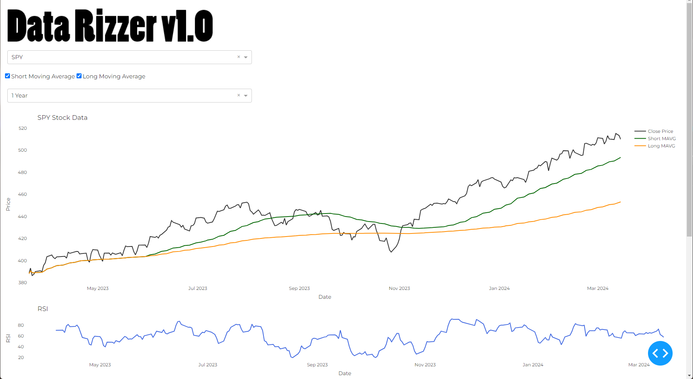

# Data Rizzer

## Dashboard Overview

Below is a screenshot of the Stock Analysis Dashboard, illustrating the user interface and features:



This document serves as a comprehensive guide for understanding and utilizing the Stock Analysis Dashboard developed using Dash, a Python framework for building analytical web applications. The dashboard provides real-time stock data visualization and analysis, including price trends and Relative Strength Index (RSI) calculations.

## Features

- Display of real-time stock prices and historical data.
- Interactive charts for stock price movements and RSI indicators.
- Customizable time range and stock selection.
- Moving average and RSI calculations for deeper analysis.

## Requirements

Before you start, ensure you have the following installed:

- Python 3.x
- Flask
- Dash
- Plotly
- Pandas
- Numpy
- yahoo_fin

## Installation

1. Clone the repository or download the script.
2. Install the required packages using pip:

   ```bash
   pip install dash flask plotly pandas numpy yahoo_fin
   ```

## Usage

1. Run the script using Python:

   ```bash
   python stock_dashboard.py
   ```

2. Open a web browser and navigate to `http://127.0.0.1:8050/dash/` to view the dashboard.

## Structure of the Dashboard

### Initialization

The script starts by importing necessary libraries and initializing a Flask app along with a Dash app. External stylesheets for design aesthetics are also included.

### Data Analysis Functions

- `moving_average`: Calculates the moving average of the stock prices for specified window periods.
- `rsi_calculation`: Computes the Relative Strength Index (RSI) for stock data, which helps identify overbought or oversold conditions.

### Layout

The Dash app layout comprises HTML and Plotly Dash components:

- A logo and header section.
- Dropdowns for selecting the stock symbol and time range.
- Checklists for selecting data series to display (short/long moving averages).
- Graph sections for plotting the stock data and RSI chart.
- An information panel displaying current stock statistics and recommendations based on RSI values.

### Callbacks

Dash callbacks are used to update the charts and information panel based on user input:

- The `update_graph` function fetches and processes stock data from Yahoo Finance, calculates moving averages, RSI, and identifies support and resistance levels based on the selected stock, data series, and time range.
- The charts and information panel are dynamically updated with the latest data.

### Running the App

The Dash app is set to run on a local server (port 8050) and is accessible via web browser.
